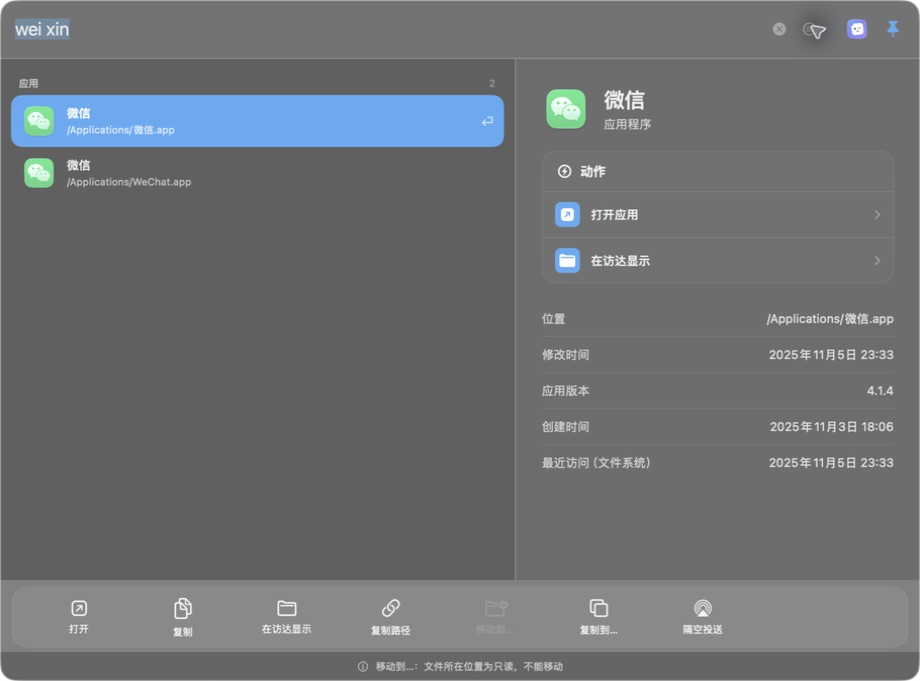
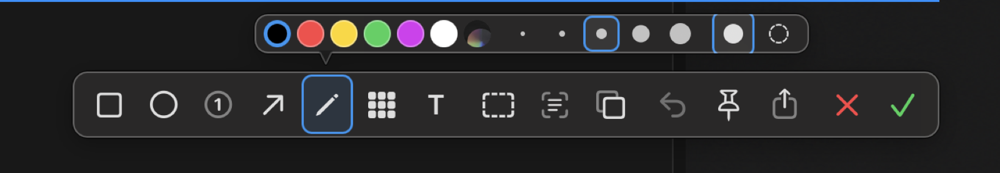
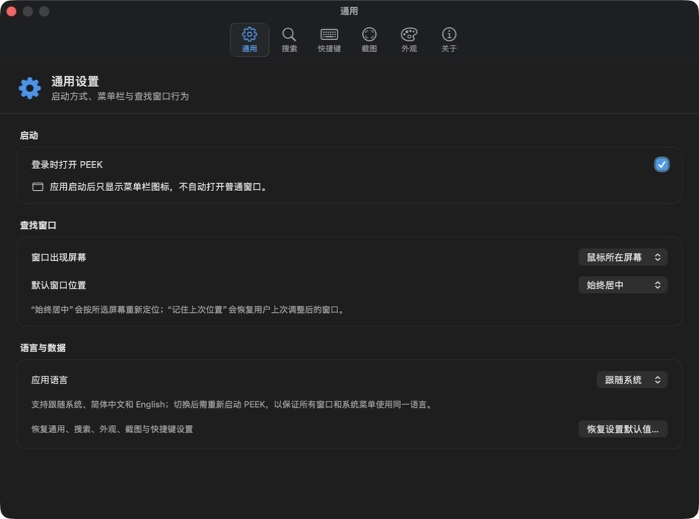

# PEEK

  

  一款简单、安静、只在本机工作的 macOS 查找与截图工具。

PEEK 常驻在 Mac 菜单栏，需要时一键出现，用完即走。它可以帮你快速找到应用、文件和文件夹，也能完成区域截图、图片标注、马赛克、文字识别、二维码识别和滚动长截图。

你的搜索词、文件索引、截图和识别结果默认只保留在本机，不会上传到云端。

## 你可以用 PEEK 做什么

### 快速查找

- 查找应用、文件和文件夹。
- 支持中文、拼音、拼音首字母和英文模糊搜索。
- 应用结果优先展示，经常打开的应用会更靠前。
- 文件可预览内容，图片可直接预览，文件夹可查看其中的项目。
- 可直接打开、复制、在访达中显示、复制路径、移动、复制到其他位置或隔空投送。

输入关键词后，PEEK 会展开应用结果、预览信息和常用操作：

### 截图与标注

- 自由框选区域，也可以移动和缩放选框。
- 默认使用红色进行画笔、箭头、矩形、椭圆、文字和序号标注。
- 支持马赛克、撤销、重做、钉图、复制和保存。
- 未框选时可以查看像素的 RGB 与 HEX 色值，单击即可复制。
- 双击选区、按 `Enter` 或点击完成，会直接把结果放入剪贴板。

### 识别文字与二维码

- OCR 可识别图片中的中文和英文，并尽量保留原有段落与排版。
- 二维码内容为文字时可复制；为网址时可复制或打开；为图片时可直接预览和保存。
- 所有识别都在 Mac 本机完成。

### 滚动长截图

- 支持自动滚动和手动滚动。
- 会自动寻找相邻画面的重叠部分并拼成长图。
- 遇到网页动画、悬浮组件或内容变化过大时会停止并提示，不会强行生成明显错位的图片。
- 如果已经获得一段可靠内容，可选择保留已完成的部分。

## 第一次使用

### 1. 打开 PEEK

启动后，PEEK 只显示在屏幕顶部的菜单栏，不会自动弹出无用的主窗口。

### 2. 授权搜索目录

第一次打开时，PEEK 会提示你授权常用目录。建议授权：

- 文稿
- 桌面
- 下载
- 其他你希望搜索的目录

PEEK 只能搜索你明确授权的个人目录。系统应用目录会自动用于查找应用，但不会扫描其中的普通系统文件。

如果暂时不授权也可以继续使用，只是未授权目录里的文件不会出现在结果中。以后可在“设置 > 搜索”中添加、删除、重新授权或恢复默认目录。

### 3. 等待首次索引

首次索引会优先处理应用，处理完成的目录会立即可搜索，不必等待全部目录结束。文件较多时，可在“设置 > 搜索”查看进度、预计时间和当前正在处理的目录。

索引会持久保存在本机。退出或重启 PEEK 后不需要从头开始，后续只会在后台低占用地更新变化内容。

### 4. 授予截图权限

第一次截图时，macOS 会要求“屏幕录制”权限；自动滚动截图还需要“辅助功能”权限。

授权屏幕录制后，请完全退出并重新打开 PEEK，使权限生效。如果之前更换过应用版本，可在“系统设置 > 隐私与安全性”中重新确认 PEEK 的权限。

## 日常使用

### 查找应用或文件

1. 按文件查找快捷键打开搜索框。
2. 输入中文、拼音或英文关键词。
3. 按 `↑`、`↓` 切换结果，按 `Enter` 打开。
4. 按住 `Option` 时会显示数字标记，可用 `Option + 数字` 快速打开对应结果。
5. 按 `Esc` 关闭搜索框。

默认快捷键可能与输入法或其他软件冲突。发生冲突时，从菜单栏打开“设置 > 快捷键”，点击当前组合后直接录入新的快捷键。

### 区域截图

1. 从菜单栏选择“区域截图”，或使用设置中显示的快捷键。
2. 拖动鼠标画出选区；未选择标注工具时，可直接拖动整个选区。
3. 选择画笔、形状、文字、马赛克、OCR、二维码或钉图等工具。
4. 点击完成，图片会进入剪贴板；需要文件时再点击保存。

截图开始后，PEEK 会冻结当时的桌面画面。移动选框只是改变取图范围，不会让底层应用收到点击，也不会混入稍后发生的画面变化。

### 滚动截图

1. 把鼠标放在希望滚动的内容区域。
2. 启动“滚动截图”，检查自动选区是否正确。
3. 需要时直接移动、缩放或重新拖画选区。
4. 确认后开始采集；自动模式不可用时可改用手动模式。

为了获得更稳定的结果，建议只框选真正滚动的正文，尽量排除固定侧栏、视频、大面积动画和悬浮按钮。

## 设置说明

- **通用**：登录时打开、菜单栏运行、窗口位置和语言。
- **搜索**：管理文档目录、应用目录、排除目录，查看索引进度与日志，并可按目录手动刷新。
- **快捷键**：修改文件查找、区域截图、滚动截图和 OCR 截图快捷键。
- **截图**：查看权限状态，调整滚动截图方式与采集参数。
- **外观**：跟随系统、浅色、深色、界面透明度和结果密度。
- **关于**：查看版本与隐私说明。

设置按功能分区，点击顶部图标即可切换：

所有设置都会自动保存，不需要再点总“保存”按钮。

## 常见问题

### 为什么桌面上的文件搜不到？

先到“设置 > 搜索”确认桌面目录已经授权，并查看该目录是否完成索引。刚增加的文件可能需要等待下一次增量更新，也可以在对应目录旁手动刷新。

### 为什么中文或拼音搜不到某个应用？

先确认应用目录已完成索引。PEEK 会读取应用提供的中英文名称并生成拼音匹配；如果应用本身没有提供中文名称，仍可使用它的英文名、包名或常见别名搜索。

### 为什么快捷键没有反应？

快捷键可能被输入法、macOS 或其他软件占用。请从菜单栏进入“设置 > 快捷键”查看冲突提示并换一个组合。

### 为什么滚动截图会停止？

通常是页面中有动画、悬浮区域、重复纹理，或滚动距离过大。可以减小步长、重新框选纯正文，或者切换手动滚动。

### 退出 PEEK 后索引会消失吗？

不会。已完成的索引保存在本机，下次启动会继续使用，只对变化内容做更新。

## 隐私与权限

- 搜索索引、搜索词、截图、OCR 和二维码结果默认只在本机处理。
- PEEK 只读取系统允许的位置，以及你通过系统文件选择器明确授权的目录。
- 删除某个授权目录后，该目录会立即停止参与搜索。
- 屏幕录制权限只用于截图；辅助功能权限只用于自动滚动和相关系统交互。
- 受保护窗口、DRM 视频和部分系统内容无法被截图，这是 macOS 的安全限制。

PEEK 支持 macOS 13 及以上版本，并提供简体中文和 English 界面。
